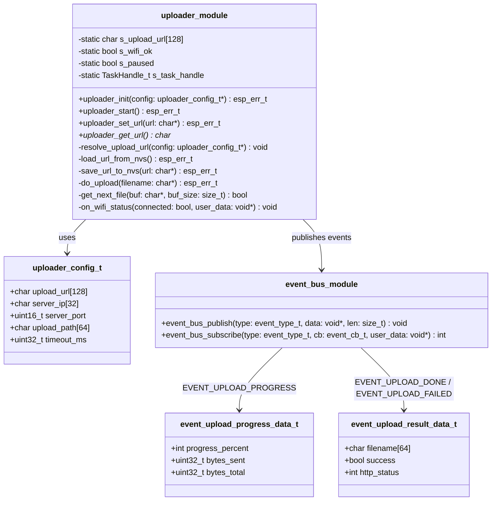
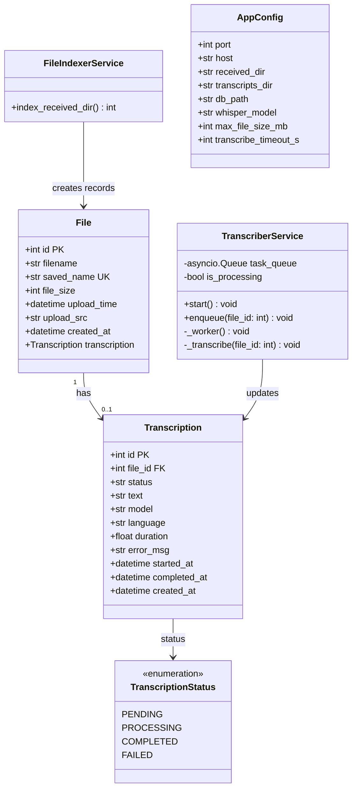
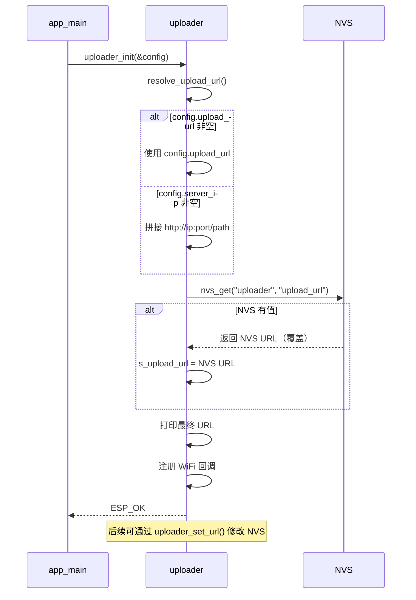
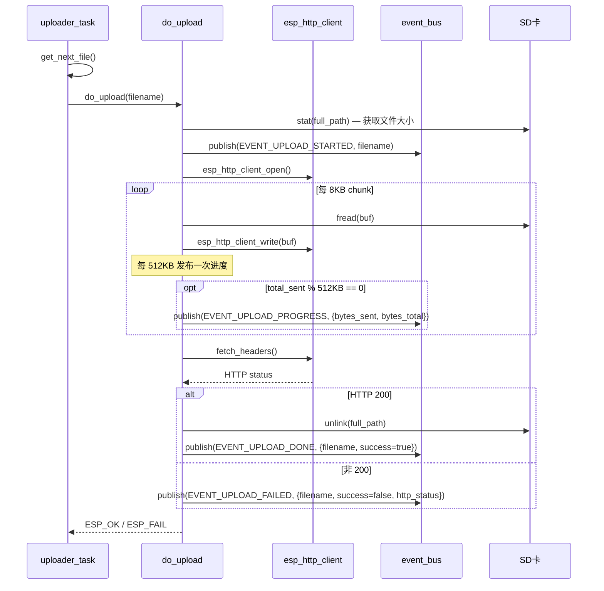
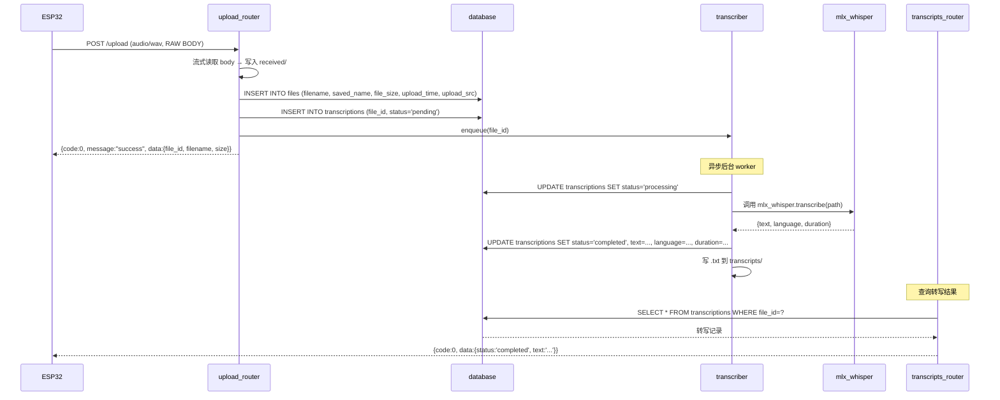
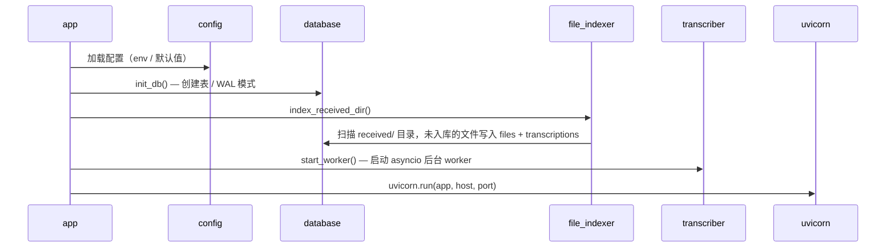
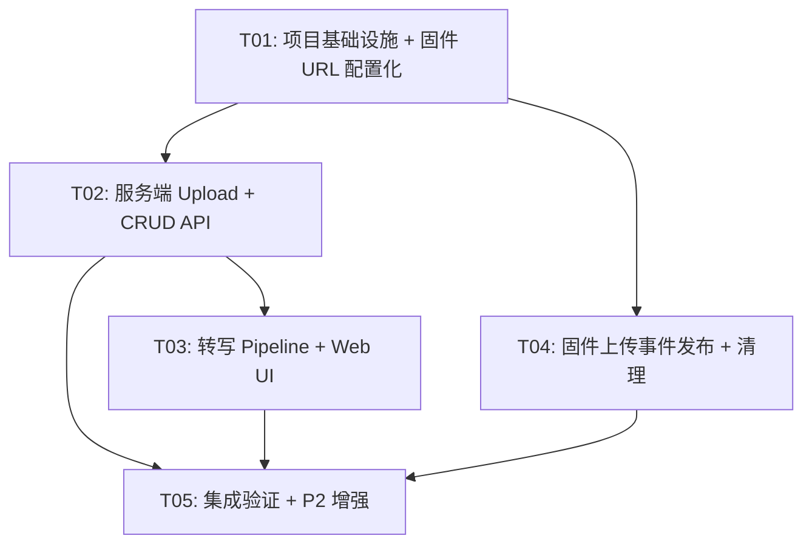

# ESP32 AI Recorder — 系统架构设计 v0.3 ~ v0.4

> Author: Bob (Architect) | Date: 2026-05-16
> 基于 PRD v0.3-v0.4 | 项目仓库: `/Users/long/Projects/esp32-recorder/`

---

## Part A: 系统设计

### 1. 实现方案与框架选型

#### 核心技术挑战

1. **Upload URL 配置化（P0）**：uploader.c 硬编码 `UPLOAD_URL`，需改为 NVS + config 优先级链，涉及 uploader_init() 重写、新增 NVS 读写函数、uploader_config_t 扩展。ESP32 RAM 有限（~320KB），URL 缓冲区限制 128 字节。

2. **服务端 Flask → FastAPI 重构（P1）**：当前 upload_server.py 是单文件 Flask 脚本，需重构为多模块 FastAPI 应用。关键挑战：保留 RAW BODY `/upload` 兼容性、SQLite 异步安全、mlx-whisper 后台转写任务的并发控制（同时只跑1个）。

3. **上传事件发布（P1-08/09）**：EVENT_UPLOAD_PROGRESS 和 EVENT_UPLOAD_DONE/FAILED 已在 event_bus.h 中定义但未发布。需在 do_upload() 的流式写入循环中增加 event_bus_publish() 调用，注意不能在 HTTP 回调上下文中做重操作。

4. **自动转写 Pipeline（P1-02）**：上传后异步触发 mlx-whisper，需 asyncio 后台任务队列 + 状态机管理，超时/失败/重试机制。

#### 框架与库选型

| 层次 | 选型 | 理由 |
|------|------|------|
| **固件框架** | ESP-IDF v5.2.3 | 已有，不变 |
| **固件 HTTP 客户端** | esp_http_client | 已有，不变 |
| **固件 NVS** | nvs_flash + nvs.h | ESP-IDF 内置，存储 upload URL 配置 |
| **服务端框架** | FastAPI + uvicorn | 原生 async、自动 OpenAPI 文档、类型校验、性能优于 Flask |
| **服务端 ORM** | SQLAlchemy 2.0 (async) | 成熟稳定，FastAPI 生态首选 |
| **服务端数据库** | SQLite + aiosqlite | 轻量零部署，单进程写入安全，WAL 模式支持并发读 |
| **服务端模板** | Jinja2 | FastAPI 原生支持，服务端渲染 HTML |
| **转写引擎** | mlx-whisper | Apple Silicon 原生加速，PRD 指定 |
| **前端** | 原生 HTML + CSS + JS | PRD 约定，避免引入前端框架 |

#### 架构模式

- **固件**：事件驱动架构（event_bus 发布/订阅）+ 生产者-消费者模式（recorder→upload_queue→uploader）
- **服务端**：分层架构（Router → Service → Model）+ 异步任务队列（asyncio.Queue 单 worker）

---

### 2. 文件列表

#### 2.1 固件端（需修改的文件）

| 相对路径 | 操作 | 说明 |
|----------|------|------|
| `firmware/components/uploader/include/uploader.h` | 修改 | 扩展 uploader_config_t，新增 upload_url 字段，新增 API 声明 |
| `firmware/components/uploader/uploader.c` | 修改 | 移除硬编码 UPLOAD_URL，实现 URL 优先级链，发布上传事件，清理废弃 API |
| `firmware/main/app_main.c` | 修改 | 更新 uploader_config_t 初始化（传入 upload_url） |

#### 2.2 服务端（新建文件）

| 相对路径 | 操作 | 说明 |
|----------|------|------|
| `server/app.py` | 新建 | FastAPI 入口，挂载路由，生命周期管理 |
| `server/config.py` | 新建 | 配置管理（端口、目录、模型名、超时） |
| `server/database.py` | 新建 | SQLite 初始化 + SQLAlchemy async engine |
| `server/models.py` | 新建 | SQLAlchemy ORM 模型（File, Transcription） |
| `server/schemas.py` | 新建 | Pydantic 请求/响应 schema |
| `server/routers/__init__.py` | 新建 | 包初始化 |
| `server/routers/upload.py` | 新建 | POST /upload — RAW BODY 接收 |
| `server/routers/files.py` | 新建 | /api/files/* — 文件 CRUD |
| `server/routers/transcripts.py` | 新建 | /api/transcripts/* — 转写管理 |
| `server/routers/status.py` | 新建 | /api/status + /health |
| `server/services/__init__.py` | 新建 | 包初始化 |
| `server/services/transcriber.py` | 新建 | mlx-whisper 封装 + 异步任务队列 |
| `server/services/file_indexer.py` | 新建 | 启动时索引 received/ 目录 |
| `server/templates/index.html` | 新建 | Web UI 主页面 |
| `server/static/style.css` | 新建 | 样式 |
| `server/static/app.js` | 新建 | 前端交互逻辑 |
| `server/requirements.txt` | 新建 | Python 依赖 |

#### 2.3 保留文件（已废弃，v0.4 清理）

| 相对路径 | 操作 | 说明 |
|----------|------|------|
| `upload_server.py` | 保留 | 旧 Flask 服务端，v0.3 过渡期保留，v0.4 删除 |

---

### 3. 数据结构与接口

#### 3.1 固件端数据结构



#### 3.2 服务端数据模型



#### 3.3 服务端 API 响应 Schema

```python
# 统一响应
class ApiResponse(BaseModel):
    code: int = 0           # 0=成功，非0=错误码
    message: str = "success"
    data: Optional[Any] = None

# 文件列表响应
class FileListData(BaseModel):
    items: List[FileItem]
    total: int
    page: int
    page_size: int

# 文件详情
class FileItem(BaseModel):
    id: int
    filename: str
    saved_name: str
    file_size: int
    upload_time: datetime
    upload_src: str
    created_at: datetime
    transcription: Optional[TranscriptItem] = None

# 转写详情
class TranscriptItem(BaseModel):
    id: int
    file_id: int
    status: str
    text: Optional[str] = None
    model: Optional[str] = None
    language: Optional[str] = None
    duration: Optional[float] = None
    error_msg: Optional[str] = None
    started_at: Optional[datetime] = None
    completed_at: Optional[datetime] = None
    created_at: datetime
```

---

### 4. 程序调用流程

#### 4.1 固件 Upload URL 解析流程



#### 4.2 固件上传 + 事件发布流程



#### 4.3 服务端上传 + 自动转写流程



#### 4.4 服务端启动流程



---

### 5. 待明确事项

| # | 事项 | 假设 | 影响 |
|---|------|------|------|
| 1 | NVS "uploader" namespace 是否已存在 | 假定不存在，需新建 | 无影响，NVS namespace 按需创建 |
| 2 | 上传进度事件发布频率：每 512KB 还是固定百分比 | PRD 说每 512KB，实现按此 | 小文件可能只有1次进度事件 |
| 3 | 服务端 POST /upload 的 RAW BODY 最大允许大小 | 默认 100MB | 需在 config.py 配置 |
| 4 | mlx-whisper 是否已安装在目标 Mac | 假定已安装，requirements.txt 声明 | 未安装时转写功能不可用，不影响上传 |
| 5 | 旧 Flask upload_server.py 是否在 v0.3 删除 | 保留到 v0.4，新 server/ 独立目录 | 两套服务端共存 |
| 6 | event_upload_result_data_t 是新增还是复用已有结构 | 新增，PRD 中仅定义了 progress_percent | 需扩展 event_bus.h 事件数据 |
| 7 | 服务端 /upload 返回格式：保持简单还是嵌套 {code,data} | PRD 要求统一 {code,message,data} 格式 | ESP32 端不解析响应体，仅看 HTTP status |

---

## Part B: 任务分解

### 6. 依赖包列表

#### 固件端（ESP-IDF 内置，无需额外安装）

```
- esp_http_client: HTTP 客户端（流式上传）
- nvs_flash: NVS 键值存储（upload URL 持久化）
- freertos: 实时操作系统（任务、信号量）
- esp_timer: 高精度定时器
```

#### 服务端（requirements.txt）

```
- fastapi@^0.115.0: Web 框架
- uvicorn[standard]@^0.32.0: ASGI 服务器
- sqlalchemy[asyncio]@^2.0.0: ORM + async 支持
- aiosqlite@^0.20.0: SQLite async 驱动
- jinja2@^3.1.0: 模板引擎
- python-multipart@^0.0.12: 请求体解析（备用）
- mlx-whisper@^0.4.0: Apple Silicon 转写引擎
```

---

### 7. 任务列表

#### T01: 项目基础设施 + 固件 Upload URL 配置化

- **Task ID**: T01
- **Task Name**: 项目基础设施 + 固件 Upload URL 配置化
- **Source Files**:
  - `firmware/components/uploader/include/uploader.h`（修改）
  - `firmware/components/uploader/uploader.c`（修改）
  - `firmware/main/app_main.c`（修改）
  - `server/requirements.txt`（新建）
  - `server/app.py`（新建 — 骨架）
  - `server/config.py`（新建）
  - `server/database.py`（新建）
  - `server/models.py`（新建）
  - `server/schemas.py`（新建）
- **Dependencies**: 无
- **Priority**: P0
- **描述**:
  1. 固件端：扩展 `uploader_config_t` 增加 `upload_url[128]` 字段，实现 URL 优先级链（config.upload_url → 拼接 ip+port+path → NVS → 默认值），移除硬编码 `UPLOAD_URL`，新增 `uploader_set_url()` / `uploader_get_url()` NVS 读写接口
  2. 服务端骨架：创建 server/ 目录结构，FastAPI 入口（app.py），配置管理（config.py），数据库初始化（database.py），ORM 模型（models.py），Pydantic schema（schemas.py），requirements.txt
  3. 更新 app_main.c 中的 uploader_config_t 初始化，传入 upload_url

#### T02: 服务端 Upload + 文件/转写 CRUD API

- **Task ID**: T02
- **Task Name**: 服务端 Upload + 文件/转写 CRUD API
- **Source Files**:
  - `server/routers/upload.py`（新建）
  - `server/routers/files.py`（新建）
  - `server/routers/transcripts.py`（新建）
  - `server/routers/status.py`（新建）
  - `server/routers/__init__.py`（新建）
  - `server/services/__init__.py`（新建）
  - `server/services/file_indexer.py`（新建）
- **Dependencies**: T01
- **Priority**: P1
- **描述**:
  1. 实现 POST /upload — RAW BODY 流式接收 WAV，保存到 received/，写入 DB，触发转写入队
  2. 实现 /api/files/* — 列表（分页+排序+过滤）、详情、删除（级联删转写+文件）、下载
  3. 实现 /api/transcripts/* — 列表、详情（含文本）、导出 .txt、手动触发转写
  4. 实现 /api/status + /health
  5. 实现统一响应格式 {code, message, data}
  6. 实现启动时 file_indexer 索引 received/ 目录
  7. 在 app.py 中挂载所有路由

#### T03: 自动转写 Pipeline + Web UI

- **Task ID**: T03
- **Task Name**: 自动转写 Pipeline + Web UI
- **Source Files**:
  - `server/services/transcriber.py`（新建）
  - `server/templates/index.html`（新建）
  - `server/static/style.css`（新建）
  - `server/static/app.js`（新建）
- **Dependencies**: T02
- **Priority**: P1
- **描述**:
  1. 实现 transcriber.py — asyncio.Queue + 单 worker 后台转写，mlx-whisper 调用封装，状态机（pending→processing→completed/failed），超时10分钟，失败重试1次
  2. 实现 Web UI — 录音文件列表页（含上传时间、大小、转写状态），转写结果展示区，系统状态面板
  3. 原生 HTML+CSS+JS，Jinja2 模板渲染，无前端框架
  4. 在 app.py 中挂载静态文件和模板

#### T04: 固件上传事件发布 + 清理

- **Task ID**: T04
- **Task Name**: 固件上传事件发布 + 清理
- **Source Files**:
  - `firmware/components/uploader/uploader.c`（修改）
  - `firmware/components/uploader/include/uploader.h`（修改）
  - `firmware/components/event_bus/include/event_bus.h`（修改）
- **Dependencies**: T01
- **Priority**: P1
- **描述**:
  1. 在 do_upload() 流式写入循环中，每 512KB 发布一次 EVENT_UPLOAD_PROGRESS，携带扩展的 event_upload_progress_data_t（增加 bytes_sent, bytes_total）
  2. 上传成功发布 EVENT_UPLOAD_DONE，携带新增 event_upload_result_data_t（filename, success, http_status）
  3. 上传失败发布 EVENT_UPLOAD_FAILED，携带同一结构体
  4. 在 event_bus.h 中新增 event_upload_result_data_t 结构体定义
  5. 扩展 event_upload_progress_data_t 增加 bytes_sent, bytes_total 字段
  6. 清理废弃 API（移除 uploader_upload, uploader_get_progress, uploader_delete_after_upload — 标记为 P2 但趁此机会一并完成）

#### T05: 集成验证 + P2 增强

- **Task ID**: T05
- **Task Name**: 集成验证 + P2 增强
- **Source Files**:
  - `firmware/main/app_main.c`（微调）
  - `server/app.py`（微调）
  - `docs/resume-evaluation.md`（新建 — 断点续传评估文档）
- **Dependencies**: T02, T03, T04
- **Priority**: P2
- **描述**:
  1. 固件端到端验证：局域网 IP 上传 10MB+ WAV（P0-03）、Tailscale Funnel 上传（P0-04）
  2. 服务端集成验证：上传→自动转写→结果查询 全链路
  3. P2-01 WiFi 指数退避重连（wifi_manager.c 改造）
  4. P2-02 大文件断点续传评估文档（仅文档，不实现）
  5. 版本号更新：v0.2.1 → v0.3
  6. app_main.c 初始化序号一致性验证（BUG-004）

---

### 8. 共享知识

```
# 固件端约定
- 所有路径通过 storage_build_vfs_path() 获取，禁止硬编码 "/sdcard" 或目录名
- inter-component 通信通过 event_bus_publish/subscribe，禁止直接跨组件调用
- audio_task 永远运行，禁止 suspend/resume
- 目录生命周期由 storage.c 独享，recorder.c 只做 fopen/fwrite/fclose
- esp_timer callback 只做 xSemaphoreGiveFromISR()，禁止重操作
- NVS namespace: "uploader"，key: "upload_url"，value max 128 bytes
- URL 优先级链: config.upload_url → ip:port/path 拼接 → NVS → 默认值
- 上传事件数据结构变更需同步更新 event_bus.h

# 服务端约定
- 统一响应格式: {code: int, message: str, data: Any}
  - code=0 表示成功，非0表示错误
  - HTTP 状态码语义正确（200, 400, 404, 500）
- SQLite WAL 模式，单进程写入安全
- 上传接口 POST /upload 保持 RAW BODY + Content-Type: audio/wav 兼容
- 转写任务同时只运行 1 个，其余排队
- 转写超时 10 分钟，失败重试 1 次（间隔 30 秒）
- 文件名冲突策略：检测重名自动追加 _1, _2 后缀
- 日期时间统一 ISO 8601 UTC 格式
- 数据库文件: server/recorder.db（运行时生成）
- 上传文件存储: server/received/
- 转写文件存储: server/transcripts/

# 跨端约定
- ESP32 上传使用 HTTP POST RAW BODY，Content-Type: audio/wav
- 服务端仅通过 HTTP status code 判断上传结果，不依赖响应体
- 文件命名：REC_SESSION_XXXX.wav（固件生成，服务端原样保存）
```

---

### 9. 任务依赖图



**关键路径**: T01 → T02 → T03 → T05

**可并行**: T04（固件事件）与 T02/T03（服务端）可并行开发，两者仅依赖 T01 的基础设施。
