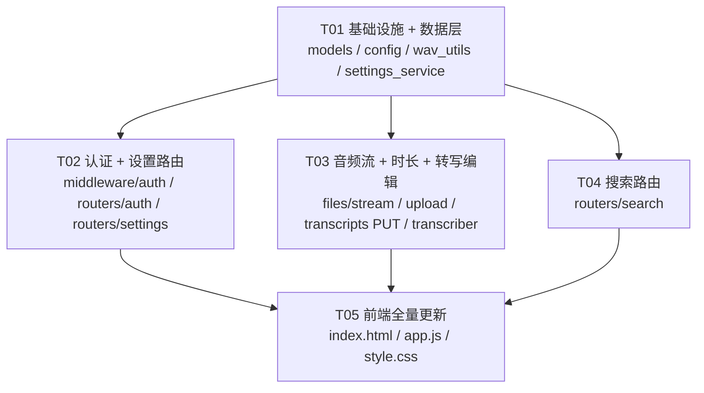

# ESP32 AI Recorder v0.4 — 增量架构设计

> 作者：Bob（软件架构师）  
> 基线版本：v0.3（已全部完成并通过联调验证）  
> 目标版本：v0.4  
> 日期：2026-05-16

---

## 概述

v0.4 是在 v0.3 基础上的**增量迭代**，核心目标是将 Web 界面从"能看"升级为"好用"，并增加基本安全保障。

所有变更严格遵循以下规则：
- 不破坏 v0.3 固件端兼容性（`/upload` 和 `/health` 免认证）
- 运行时设置变更通过 `settings` 表，禁止修改 `config.py` 常量
- 转写语言参数链路：`settings 表` → `Transcriber` → `mlx-whisper`

---

## 1. 新增文件清单

| 文件路径（相对 server/） | 用途说明 |
|--------------------------|----------|
| `routers/auth.py` | 认证路由：POST /api/auth/login、POST /api/auth/logout；处理密码校验和 session cookie 签发 |
| `routers/settings.py` | 设置路由：GET/PUT /api/settings、GET /api/settings/models；读写 settings 表 |
| `routers/search.py` | 搜索路由：GET /api/search；SQLite LIKE 全文搜索转写文本 |
| `middleware/auth.py` | 认证中间件：检查 session cookie，对未认证请求返回 401（/health、/upload、/api/auth/* 豁免） |
| `services/settings_service.py` | settings 表 CRUD 服务；提供 `get_setting(key)` / `set_setting(key, value)` / `get_all_settings()` / `init_default_settings()` 函数 |
| `services/wav_utils.py` | WAV 文件工具：`read_wav_duration(path)` 从 WAV header 读取时长（秒）；无需解码音频 |

---

## 2. 修改文件清单

### `server/models.py`

**修改内容**：
1. `File` 模型新增 `duration` 字段（Float，可为 null，单位秒）
2. `Transcription` 模型新增 `is_edited`（Integer 默认 0）和 `edited_at`（DateTime 可为 null）字段
3. 新增 `Setting` ORM 模型（key-value 表，支持 settings 表读写）

**涉及需求**：P0-01, P0-03, P0-06, P0-07

---

### `server/config.py`

**修改内容**：
1. `AppConfig` 新增 `auth_password: str`（默认 `"changeme"`，支持 `RECORDER_AUTH_PASSWORD` 环境变量覆盖）
2. `AppConfig` 新增 `auth_enabled: bool`（默认 `True`，支持 `RECORDER_AUTH_ENABLED` 环境变量覆盖）
3. `AppConfig` 新增 `session_secret: str`（默认随机字符串，支持 `RECORDER_SESSION_SECRET` 环境变量覆盖；用于 itsdangerous 签名）

**涉及需求**：P0-05

---

### `server/database.py`

**修改内容**：
无结构变更。`init_db()` 中 `Base.metadata.create_all` 会自动创建新增的 `settings` 表。

**涉及需求**：P0-06

---

### `server/app.py`

**修改内容**：
1. 挂载新增路由：`auth.router`、`settings.router`、`search.router`
2. `lifespan` 启动时调用 `init_default_settings()`（幂等：仅在 settings 表为空时插入默认值）
3. 注册 `AuthMiddleware`（在路由挂载之后注册）
4. 版本号更新为 `0.4.0`

**涉及需求**：P0-01, P0-04, P0-05, P0-06

---

### `server/schemas.py`

**修改内容**：
1. `FileListItem` 和 `FileItem` 新增 `duration: Optional[float]` 字段（P0-07）
2. `TranscriptItem` 和 `TranscriptListItem` 新增 `is_edited: int`、`edited_at: Optional[datetime]` 字段（P0-03）
3. 新增 `SettingItem` schema（key, value, updated_at）
4. 新增 `SettingsData` schema（所有设置的字典形式）
5. 新增 `TranscriptEditRequest` schema（`text: str`，编辑保存请求体）
6. 新增 `SearchResultItem` schema（file_id, filename, upload_time, duration, transcript_snippet, highlight）
7. 新增 `LoginRequest` schema（`password: str`）
8. 新增错误码常量：`UNAUTHORIZED = 40100`、`FORBIDDEN = 40300`

**涉及需求**：P0-01, P0-03, P0-04, P0-05, P0-06, P0-07

---

### `server/routers/files.py`

**修改内容**：
1. 新增路由 `GET /api/files/{file_id}/stream`：返回 WAV 文件流，支持 HTTP Range 请求（`Content-Range` 响应头），用于浏览器内嵌播放器
2. `list_files` 和 `get_file` 的序列化辅助函数 `_file_to_item` / `_file_to_detail` 补充 `duration` 字段输出
3. `upload.py` 上传完成后调用 `read_wav_duration` 写入 `files.duration`（在文件写入磁盘后同步读取 WAV header）

**涉及需求**：P0-02, P0-07

---

### `server/routers/transcripts.py`

**修改内容**：
1. 新增路由 `PUT /api/transcripts/{file_id}`：接收 `TranscriptEditRequest`，更新 `text`、`is_edited=1`、`edited_at=now()`
2. `trigger_transcribe`（POST /api/transcribe/{file_id}）重置时需清空 `is_edited` 和 `edited_at`（重新转写覆盖手动编辑）
3. 序列化辅助函数补充 `is_edited`、`edited_at` 字段输出

**涉及需求**：P0-03

---

### `server/routers/upload.py`

**修改内容**：
1. 文件写入成功后，调用 `wav_utils.read_wav_duration(file_path)` 获取时长，写入 `File.duration`
2. 同时将 `auto_transcribe` 设置（从 settings 表读取）判断是否自动入队转写（默认 True）

**涉及需求**：P0-06, P0-07

---

### `server/services/transcriber.py`

**修改内容**：
1. `_transcribe_audio` 静态方法新增 `language: Optional[str]` 参数，透传给 `mlx_whisper.transcribe(audio_path, path_or_hf_repo=model, language=language)`
2. `_process_file` 在执行转写前从 settings 表读取 `transcribe_language` 和 `transcribe_model`（覆盖 config 中的静态配置）
3. `_process_file` 写入数据库时，`db_trans.model` 记录实际使用的模型名（从 settings 读取）

**涉及需求**：P0-01, P0-06

---

### `server/services/file_indexer.py`

**修改内容**：
1. 索引时调用 `read_wav_duration(file_path)`，将时长写入 `File.duration`

**涉及需求**：P0-07

---

### `server/templates/index.html`

**修改内容**：
1. Tab 导航从 3 个扩展为 4 个（新增"设置"Tab，调整"系统状态"为第 4 个）
2. 录音列表表头新增"时长"列
3. 新增全局搜索输入框（位于 header 区域）
4. 新增音频播放器区域（`<audio>` 元素 + 控制条，嵌入录音列表详情面板）
5. 新增"设置"Tab 面板 HTML 结构（转写语言下拉、模型下拉、自动转写开关、密码修改）
6. 新增登录遮罩层（`#login-overlay`，未认证时显示）
7. 日期范围筛选器 HTML（开始日期/结束日期 input[type=date]）

**涉及需求**：P0-01, P0-02, P0-03, P0-04, P0-05, P0-06, P0-07, P0-08

---

### `server/static/app.js`

**修改内容**：
1. **认证模块**：启动时检查 localStorage 存储的密码（`rec_password`），调用 `/api/auth/login` 验证；未认证时显示登录遮罩；退出登录清除 cookie 和 localStorage
2. **设置 Tab 模块**：加载 `/api/settings`，渲染语言/模型下拉和开关；保存时 PUT `/api/settings`
3. **音频播放模块**：点击文件行时，将 `<audio>` 的 `src` 设置为 `/api/files/{id}/stream`；支持播放/暂停/进度条
4. **转写编辑模块**：详情面板中转写文本改为 `<textarea>`；点击"保存"时 PUT `/api/transcripts/{file_id}`；显示"已编辑"标记和 `edited_at`
5. **搜索模块**：搜索框输入 debounce 300ms 后调用 `/api/search?q=keyword`；搜索结果高亮显示匹配词
6. **时长显示**：`_file_to_item` 渲染增加 `duration` 列，调用已有 `formatDuration()` 函数
7. **日期筛选**：录音列表区新增日期范围 input，`loadFiles()` 时附加 `date_from`/`date_to` 参数（已有后端支持，前端补齐 UI）
8. **Tab 扩展**：从 3 个 Tab 扩展到 4 个，新增"设置"Tab 激活逻辑
9. **state 扩展**：新增 `searchQuery`、`dateFrom`、`dateTo`、`isAuthenticated` 等状态变量

**涉及需求**：P0-01, P0-02, P0-03, P0-04, P0-05, P0-06, P0-07, P0-08

---

### `server/static/style.css`

**修改内容**：
1. 新增登录遮罩样式（全屏遮罩 + 密码输入框居中）
2. 新增音频播放器样式（`<audio>` 宽度、控制条颜色适配）
3. 新增"已编辑"标记 badge 样式（绿色小标签）
4. 新增搜索结果高亮样式（`<mark>` 黄色背景）
5. 新增设置 Tab 表单样式（两列布局、下拉框、开关按钮）
6. 新增日期筛选器样式（与现有 filter-bar 风格一致）

**涉及需求**：P0-02, P0-03, P0-04, P0-05, P0-06, P0-08

---

### `server/requirements.txt`

**修改内容**：
新增一行：`itsdangerous>=2.1.0`（session cookie 签名）

**涉及需求**：P0-05

---

## 3. 数据库 Schema 变更

```sql
-- =====================================================================
-- 新增：设置表（key-value，持久化运行时配置）
-- =====================================================================
CREATE TABLE settings (
    key         TEXT PRIMARY KEY,
    value       TEXT NOT NULL,
    updated_at  DATETIME DEFAULT CURRENT_TIMESTAMP
);

-- 预置默认设置项（通过 init_default_settings() 幂等插入）：
-- INSERT OR IGNORE INTO settings VALUES ('transcribe_language', 'zh', CURRENT_TIMESTAMP);
-- INSERT OR IGNORE INTO settings VALUES ('transcribe_model', 'mlx-community/whisper-large-v3-turbo', CURRENT_TIMESTAMP);
-- INSERT OR IGNORE INTO settings VALUES ('auto_transcribe', 'true', CURRENT_TIMESTAMP);

-- =====================================================================
-- 修改：files 表新增字段
-- =====================================================================
ALTER TABLE files ADD COLUMN duration REAL;
-- 说明：音频时长（秒），从 WAV header 读取；旧记录为 NULL（由 file_indexer 补填）

-- =====================================================================
-- 修改：transcriptions 表新增字段
-- =====================================================================
ALTER TABLE transcriptions ADD COLUMN is_edited   INTEGER DEFAULT 0;
-- 说明：是否被手动编辑过（0=原始转写，1=已编辑）

ALTER TABLE transcriptions ADD COLUMN edited_at   DATETIME;
-- 说明：最后一次手动编辑的时间戳（UTC）
```

> **注意**：`language` 字段在 v0.3 的 `transcriptions` 表中已存在（`mlx_whisper.transcribe()` 返回的检测语言），v0.4 将其语义扩展为"实际使用的语言（指定或检测到的）"，无需 ALTER。

---

## 4. 新增 API 端点清单

| Method | Path | 说明 | 对应需求 |
|--------|------|------|----------|
| `POST` | `/api/auth/login` | 密码验证，成功后在响应中 Set-Cookie `rec_session` | P0-05 |
| `POST` | `/api/auth/logout` | 清除 session cookie，返回 200 | P0-05 |
| `GET` | `/api/files/{id}/stream` | 流式返回 WAV 文件，支持 HTTP Range 请求（bytes=start-end），用于浏览器 `<audio>` 播放 | P0-02 |
| `PUT` | `/api/transcripts/{file_id}` | 更新转写文本（编辑保存），body: `{"text": "..."}` | P0-03 |
| `GET` | `/api/search?q=keyword` | 全文搜索转写文本（SQLite LIKE `%keyword%`），返回匹配文件列表含片段 | P0-04 |
| `GET` | `/api/settings` | 获取所有设置（transcribe_language, transcribe_model, auto_transcribe） | P0-01, P0-06 |
| `PUT` | `/api/settings` | 批量更新设置，body: `{"transcribe_language": "zh", ...}` | P0-01, P0-06 |
| `GET` | `/api/settings/models` | 返回可用转写模型列表（硬编码白名单） | P0-06 |

---

## 5. 共享约定（跨文件）

### 5.1 统一响应格式（继承 v0.3）

所有 JSON API 响应使用统一格式（`schemas.ApiResponse`）：
```json
{
  "code": 0,
  "message": "success",
  "data": { ... }
}
```
- `code = 0` 表示成功
- `code = 40100` 表示未认证（需登录）
- 错误时 `data` 为 `null`

---

### 5.2 settings 表 key 命名规范

| key | value 类型 | 允许值 | 默认值 |
|-----|-----------|--------|--------|
| `transcribe_language` | string | `zh` / `en` / `ja` / `ko` / `auto` | `zh` |
| `transcribe_model` | string | 见 `/api/settings/models` 返回的白名单 | `mlx-community/whisper-large-v3-turbo` |
| `auto_transcribe` | string | `true` / `false` | `true` |

> 全部以 `TEXT` 存储，布尔值用字符串 `"true"` / `"false"` 表示，服务端读取时做类型转换。

---

### 5.3 session cookie 认证方案

- **库**：`itsdangerous.URLSafeTimedSerializer`
- **cookie 名**：`rec_session`
- **签名内容**：`{"auth": true}`（固定内容，仅用于验证持有者已通过密码校验）
- **有效期**：7 天（`max_age=604800`）；服务重启后因 `session_secret` 持久化（.env 或环境变量）不失效
- **签名密钥**：`config.session_secret`，优先从 `RECORDER_SESSION_SECRET` 环境变量读取，未设置则使用固定默认值（个人工具可接受）
- **登录流程**：
  1. POST `/api/auth/login` body `{"password": "xxx"}`
  2. 服务端比对 `config.auth_password`（常量时效密码，不存 DB）
  3. 匹配则 `response.set_cookie("rec_session", signed_token, max_age=604800, httponly=True)`
  4. 前端同时在 `localStorage["rec_password"]` 存明文密码用于自动重登（页面刷新时自动重验证）
- **中间件豁免路径**：`/health`、`/upload`、`/api/auth/login`、`/api/auth/logout`、`/static/*`

---

### 5.4 WAV 时长计算方式

从 WAV 文件 header 读取，**不解码音频数据**，实现在 `wav_utils.read_wav_duration(path: str) -> Optional[float]`：

```
WAV Header 布局（PCM 格式）：
  offset 0  : 4 bytes  — "RIFF"
  offset 4  : 4 bytes  — file_size (LE uint32)
  offset 8  : 4 bytes  — "WAVE"
  offset 12 : 4 bytes  — "fmt "
  offset 16 : 4 bytes  — fmt_chunk_size (通常 16)
  offset 20 : 2 bytes  — audio_format (1=PCM)
  offset 22 : 2 bytes  — num_channels
  offset 24 : 4 bytes  — sample_rate
  offset 28 : 4 bytes  — byte_rate
  offset 32 : 2 bytes  — block_align
  offset 34 : 2 bytes  — bits_per_sample
  offset 36 : 4 bytes  — "data"
  offset 40 : 4 bytes  — data_chunk_size

duration = data_chunk_size / byte_rate
```

使用 Python 标准库 `struct.unpack_from`，无需第三方依赖。失败时返回 `None`（文件损坏等情况）。

---

### 5.5 认证中间件挂载方式

使用 FastAPI `middleware` 装饰器挂载 `AuthMiddleware`（Starlette BaseHTTPMiddleware）：

```python
# app.py — lifespan 之后、create_app() 内部
from .middleware.auth import AuthMiddleware
app.add_middleware(AuthMiddleware)
```

中间件逻辑：
1. 检查请求路径是否在豁免列表，是则 `await call_next(request)` 放行
2. 若 `config.auth_enabled == False`，直接放行
3. 读取 `request.cookies.get("rec_session")`，用 `URLSafeTimedSerializer` 验证签名和有效期
4. 验证失败返回 `JSONResponse({"code": 40100, "message": "Unauthorized"}, status_code=401)`

---

### 5.6 settings 服务读取惯例

`services/settings_service.py` 提供模块级函数，所有需要读取设置的地方使用统一接口：

```python
# 读取单个设置（带默认值）
value = await get_setting(key, default="zh")

# 批量读取所有设置（返回 dict）
settings = await get_all_settings()

# 写入（upsert）
await set_setting(key, value)

# 启动时初始化默认值（幂等）
await init_default_settings()
```

---

## 6. 任务列表

| 序号 | 任务 | 文件 | 依赖 | P0 需求 | 预估复杂度 |
|------|------|------|------|---------|-----------|
| T01 | **基础设施 + 数据层**：新增 `Setting` ORM 模型、`wav_utils.py`、`settings_service.py`；config.py 新增认证配置项；requirements.txt 新增 itsdangerous；database 和 models 更新（含 duration/is_edited/edited_at 字段）；`init_default_settings()` 实现 | `models.py`、`config.py`、`requirements.txt`、`services/settings_service.py`、`services/wav_utils.py` | 无 | P0-01, P0-05, P0-06, P0-07 | 低 |
| T02 | **认证 + 设置路由**：实现 `middleware/auth.py`（session cookie 验证中间件）、`routers/auth.py`（login/logout）、`routers/settings.py`（settings CRUD + models 列表）；app.py 挂载新路由和中间件，lifespan 调用 `init_default_settings()` | `middleware/auth.py`、`routers/auth.py`、`routers/settings.py`、`app.py`、`schemas.py`（新增相关 schema） | T01 | P0-01, P0-05, P0-06 | 中 |
| T03 | **音频流 + 时长 + 转写编辑**：`files.py` 新增 `/stream` Range 请求端点；`upload.py` 写入 `File.duration`；`file_indexer.py` 索引时填充 duration；`transcripts.py` 新增 PUT 编辑端点；`transcriber.py` 语言/模型参数从 settings 读取 | `routers/files.py`、`routers/upload.py`、`services/file_indexer.py`、`routers/transcripts.py`、`services/transcriber.py` | T01 | P0-01, P0-02, P0-03, P0-07 | 中 |
| T04 | **搜索路由**：实现 `routers/search.py`（GET /api/search，SQLite LIKE 搜索转写文本，返回含文件信息和文本片段）；schemas.py 新增搜索相关 schema；app.py 挂载 search router | `routers/search.py`、`schemas.py`、`app.py` | T01 | P0-04 | 低 |
| T05 | **前端全量更新**：`index.html` 扩展为 4-tab（录音列表/转写记录/设置/系统状态），新增登录遮罩、播放器 HTML、搜索框、日期筛选器、设置面板；`app.js` 实现认证模块、设置 Tab、音频播放、转写编辑、搜索高亮、时长列、日期筛选；`style.css` 补充所有新增 UI 样式 | `templates/index.html`、`static/app.js`、`static/style.css` | T02, T03, T04 | P0-01, P0-02, P0-03, P0-04, P0-05, P0-06, P0-07, P0-08 | 高 |

---

## 7. 任务依赖图



> **可并行**：T02、T03、T04 均仅依赖 T01，可在 T01 完成后并行实现；T05 需等待 T02+T03+T04 全部完成后进行前后端联调。

---

## 8. 关键设计决策与说明

### 8.1 为什么 `language` 字段在 v0.4 语义不变

v0.3 `transcriptions.language` 字段存储 `mlx-whisper` **检测到的**语言代码。  
v0.4 将其语义扩展为"实际有效的语言"——若用户指定了 `transcribe_language=zh`，则写入 `zh`；若指定 `auto`，则写入 whisper 检测到的实际语言。  
**字段无需 ALTER**，仅需调整 `transcriber.py` 的写入逻辑。

### 8.2 HTTP Range 请求实现要点

浏览器 `<audio>` 标签在播放 WAV 时会发送 `Range: bytes=0-` 或跳转时发送 `Range: bytes=N-M`。  
FastAPI 的 `FileResponse` 不支持 Range 请求，需在 `files.py` 的 `/stream` 端点中手动实现：
- 读取 `Range` 请求头，解析 start/end
- 使用 `StreamingResponse` 分块返回，设置 `Content-Range`、`Accept-Ranges: bytes`、`Content-Length` 响应头
- 状态码：完整返回 `200`，部分返回 `206 Partial Content`

### 8.3 转写语言参数透传链路

```
前端设置 Tab 保存
  → PUT /api/settings {"transcribe_language": "zh"}
  → settings_service.set_setting("transcribe_language", "zh")
  → settings 表写入（持久化）
  → 下次转写任务：
    transcriber._process_file()
      → await get_setting("transcribe_language", default="zh") → "zh"
      → _transcribe_audio(path, model, language="zh")
        → mlx_whisper.transcribe(path, path_or_hf_repo=model, language="zh")
```

### 8.4 session cookie 与前端密码存储

个人工具场景下，前端将密码存储在 `localStorage["rec_password"]` 中，页面加载时自动调用 `/api/auth/login` 完成认证（避免每次刷新都需要手动输入）。  
`rec_session` cookie 设置为 `httponly=True`，无法被 JS 读取，仅用于 API 请求认证。

### 8.5 不清楚的点 / 假设

1. **密码修改**：PRD 设置页写了"修改密码"，但 v0.4 的密码是存在 `config.py`（通过 .env 文件）的，修改密码需要改 .env 并重启；v0.4 暂不提供"运行时修改密码"接口（该接口属于 settings 表与 config 的边界问题，留 v0.5 讨论）。设置页的"修改密码"表单 **仅做 UI 占位，暂不实现后端接口**，前端点击"确认"时提示"请修改 .env 文件中的 AUTH_PASSWORD 配置后重启服务"。
2. **`transcribe_model` 写入时机**：当用户在设置页切换模型后，**已在队列中的任务**仍使用切换前的模型（因为已入队），**新触发的转写**才使用新模型。这是合理的行为，无需特殊处理。
3. **旧文件的 duration 回填**：`file_indexer.py` 修改后，**下次服务重启时**会尝试为已索引但 duration 为 NULL 的文件回填时长（需额外判断）。为简化实现，v0.4 仅在索引**新文件**时填充 duration；已有旧记录的 duration 保持 NULL，前端用"—"显示。

---

*文档结束*
