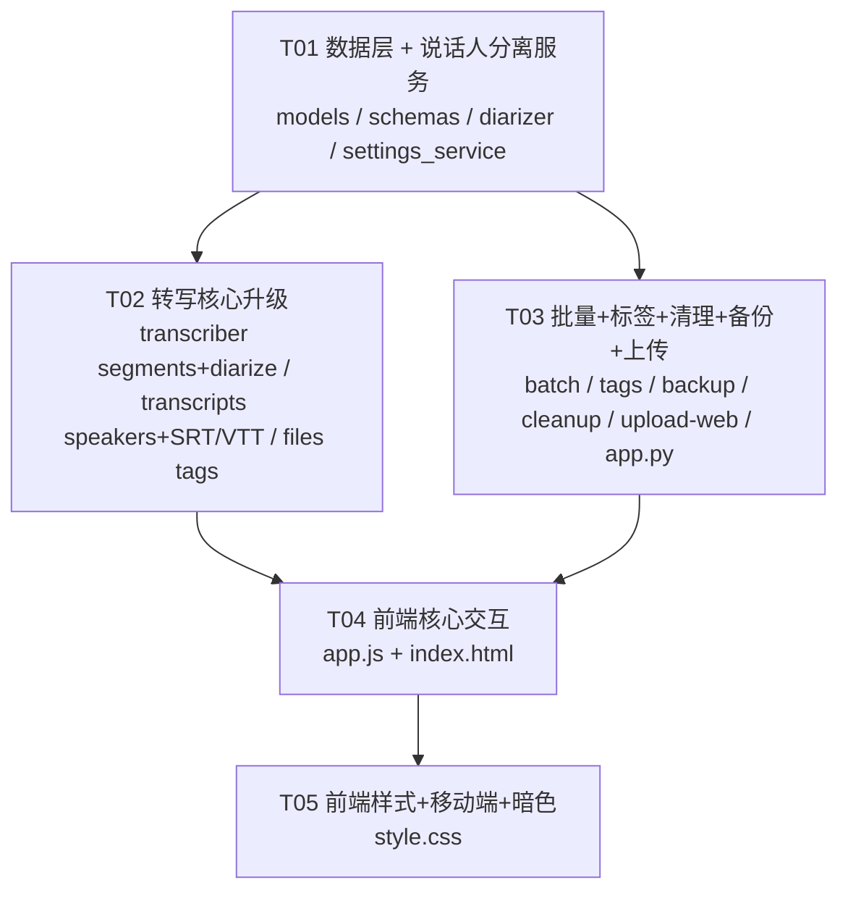

# ESP32 AI Recorder v0.5 — 增量架构设计

> 作者：Bob（软件架构师）
> 基线版本：v0.4（commit `f0bfdb0`，P0-01~P0-08 已全部实现）
> 目标版本：v0.5
> 日期：2026-05-18

---

## 概述

v0.5 在 v0.4 基础上**增量迭代**，核心目标是将转写质量从"能用"升级为"专业"（说话人分离 + 时间戳分段），同时增加批量操作、标签系统、自动清理等效率提升功能，以及移动端适配和暗色模式等体验增强。

所有变更严格遵循以下规则（继承自 v0.3/v0.4）：
- 不破坏固件端兼容性（`/upload` 和 `/health` 免认证）
- 运行时设置变更通过 `settings` 表，禁止修改 `config.py` 常量
- 转写语言参数链路：`settings 表` → `Transcriber` → `mlx-whisper`
- **说话人分离为可选**，依赖 `pyannote-audio`，安装失败时降级为手动标注模式

---

## 1. 新增文件清单

| 文件路径（相对 server/） | 用途说明 |
|--------------------------|----------|
| `services/diarizer.py` | 说话人分离服务：封装 pyannote-audio 聚类调用；提供 `is_available()` 检测；降级时返回空结果 |
| `services/cleanup.py` | 自动清理服务：asyncio 定时任务，根据 `cleanup_days` 设置清理超期文件；提供手动触发接口 |
| `routers/tags.py` | 标签路由：GET/POST/DELETE /api/tags；POST/DELETE /api/files/{id}/tags |
| `routers/batch.py` | 批量操作路由：POST /api/files/batch-delete；POST /api/transcribe/batch |
| `routers/backup.py` | 备份路由：POST /api/backup/export；POST /api/backup/import |

---

## 2. 修改文件清单

### `server/models.py`

**修改内容**：
1. `Transcription` 模型新增 `segments` 字段（Text，JSON 存储 `[{start, end, text}]`）
2. `Transcription` 模型新增 `speakers` 字段（Text，JSON 存储 `[{id, name, segment_indices}]`）
3. 新增 `Tag` ORM 模型（id, name, color, created_at）
4. 新增 `FileTag` ORM 模型（file_id, tag_id，联合主键，级联删除）
5. `File` 模型新增 `tags` relationship（many-to-many 通过 file_tags）

**涉及需求**：P1-01, P1-02, P1-06

---

### `server/schemas.py`

**修改内容**：
1. `TranscriptItem` 新增 `segments: Optional[str]`（JSON 字符串）和 `speakers: Optional[str]`（JSON 字符串）字段
2. `TranscriptListItem` 新增 `segments` 和 `speakers` 字段（可选）
3. 新增 `SegmentItem` schema（`start: float`, `end: float`, `text: str`）
4. 新增 `SpeakerItem` schema（`id: str`, `name: str`, `segment_indices: List[int]`）
5. 新增 `SpeakersUpdateRequest` schema（`speakers: List[SpeakerItem]`，用于更新说话人名称）
6. 新增 `BatchDeleteRequest` schema（`file_ids: List[int]`）
7. 新增 `BatchTranscribeRequest` schema（`file_ids: List[int]`, `model: Optional[str]`）
8. 新增 `TagCreateRequest` schema（`name: str`, `color: Optional[str]`）
9. 新增 `FileTagRequest` schema（`tag_ids: List[int]`）
10. 新增 `TagItem` schema（`id: int`, `name: str`, `color: str`, `created_at: datetime`）
11. `FileListItem` / `FileItem` 新增 `tags: Optional[List[TagItem]]` 字段
12. `SettingsUpdateRequest` 新增 `cleanup_days: Optional[str]`、`diarize_enabled: Optional[str]` 字段
13. 新增 `ExportFormat` 枚举（`srt`, `vtt`）

**涉及需求**：P1-01, P1-02, P1-04, P1-06, P1-07

---

### `server/services/transcriber.py`

**修改内容**：
1. `_transcribe_audio` 方法新增参数解析：从 `mlx_whisper.transcribe()` 返回结果中提取 `segments`（每个 segment 含 start/end/text）
2. `_process_file` 转写成功后，将 `segments` JSON 写入 `Transcription.segments`
3. `_process_file` 转写成功后，如果 `diarize_enabled` 设置为 `"true"`，调用 `diarizer.py` 进行说话人分离
4. `_process_file` 转写成功后，将 `speakers` JSON 写入 `Transcription.speakers`
5. `_process_file` 新增 model 参数支持：重新转写时可指定模型（从 batch 或 trigger_transcribe 传入）
6. 重置转录记录时清空 `segments` 和 `speakers`

**涉及需求**：P1-01, P1-02, P1-03

---

### `server/routers/transcripts.py`

**修改内容**：
1. `GET /api/transcripts/{file_id}/export` 新增 `format` 查询参数（`txt`/`srt`/`vtt`），默认 `txt`
2. 新增 `GET /api/transcripts/{file_id}/speakers` 端点：获取说话人信息
3. 新增 `PUT /api/transcripts/{file_id}/speakers` 端点：更新说话人名称
4. `POST /api/transcribe/{file_id}` 新增可选 `model` 查询参数（重新转写时指定模型）
5. 序列化辅助函数补充 `segments` 和 `speakers` 字段输出

**涉及需求**：P1-01, P1-02, P1-03, P1-07

---

### `server/routers/files.py`

**修改内容**：
1. `list_files` 和 `get_file` 序列化辅助函数补充 `tags` 字段输出
2. `delete_file` 删除时级联清理 `file_tags` 关联记录（通过 ORM cascade 自动处理）
3. `list_files` 新增 `tag_id` 查询参数（按标签筛选文件）

**涉及需求**：P1-06

---

### `server/routers/settings.py`

**修改内容**：
1. `SettingsUpdateRequest` 新增 `cleanup_days` 和 `diarize_enabled` 字段
2. 设置保存逻辑增加 `cleanup_days` 和 `diarize_enabled` 的写入

**涉及需求**：P1-01, P1-05

---

### `server/services/settings_service.py`

**修改内容**：
1. `DEFAULTS` 字典新增 `cleanup_days: "90"` 和 `diarize_enabled: "false"` 默认项

**涉及需求**：P1-01, P1-05

---

### `server/app.py`

**修改内容**：
1. 挂载新增路由：`tags.router`、`batch.router`、`backup.router`
2. `lifespan` 启动时启动 `cleanup_service` 定时任务
3. `lifespan` 关闭时停止 `cleanup_service`
4. 版本号更新为 `0.5.0`

**涉及需求**：P1-04, P1-05, P1-06, P1-10

---

### `server/routers/upload.py`

**修改内容**：
1. 支持 `multipart/form-data` 上传方式（P1-11 拖拽上传），保留原有 raw body 方式兼容固件
2. 新增 `POST /upload/web` 端点：multipart 上传，带文件大小限制和进度回调

**涉及需求**：P1-11

---

### `server/requirements.txt`

**修改内容**：
1. 新增 `pyannote-audio>=3.1.0`（标注为可选依赖，说话人分离）

**涉及需求**：P1-01

---

### `server/templates/index.html`

**修改内容**：
1. 转写详情面板增加"时间戳分段显示"区域（每个 segment 显示 `[mm:ss] 文本`，可点击跳转播放）
2. 转写详情面板增加"说话人"标识（每段显示说话人标签 S1/S2/自定义名称）
3. 录音列表表头增加 checkbox 列（批量操作多选）
4. 录音列表下方增加批量操作栏（批量删除、批量转写按钮）
5. 转写详情面板增加标签区域（显示已有标签 + 添加标签输入框）
6. 设置 Tab 增加"说话人分离"开关和"自动清理天数"输入
7. 转写详情操作栏增加"导出 SRT"和"导出 VTT"按钮
8. 设置 Tab 增加"数据备份"区域（导出/导入按钮）
9. 录音列表区域增加拖拽上传区域（drop zone）
10. header 增加暗色模式切换按钮
11. `<html>` 标签增加 `class` 属性支持 `data-theme="dark"`
12. 版本号更新为 v0.5.0

**涉及需求**：P1-01, P1-02, P1-04, P1-05, P1-06, P1-07, P1-08, P1-09, P1-10, P1-11

---

### `server/static/app.js`

**修改内容**：
1. **时间戳分段显示**：转写详情加载时，如果 `segments` 存在，渲染为 `[mm:ss] 文本` 格式；点击时间戳跳转播放位置
2. **说话人显示**：如果 `speakers` 存在，每段前显示说话人标签和颜色圆点；双击标签可修改名称
3. **批量操作**：列表行增加 checkbox；选中后底部出现操作栏；批量删除/转写调用 batch API
4. **标签系统**：详情面板标签区域；标签输入自动补全；添加/移除标签 API 调用
5. **SRT/VTT 导出**：点击按钮调用 `/api/transcripts/{id}/export?format=srt|vtt`
6. **拖拽上传**：录音列表区域增加 dragover/drop 事件监听；调用 `/upload/web` 端点
7. **暗色模式**：header 切换按钮；CSS 变量类名切换；localStorage 持久化
8. **自动清理天数**：设置 Tab 新增输入框；保存时写入 settings
9. **数据备份**：设置 Tab 增加"导出备份"和"导入备份"按钮
10. **多模型转写**：重新转写时弹出模型选择下拉框
11. **标签筛选**：录音列表增加标签筛选下拉框

**涉及需求**：P1-01~P1-11 全部

---

### `server/static/style.css`

**修改内容**：
1. 新增暗色模式 CSS 变量集（`[data-theme="dark"]` 选择器覆盖 `:root` 变量）
2. 新增时间戳分段样式（`.segment-item`、`.segment-time`、`.segment-text`）
3. 新增说话人标签样式（`.speaker-badge`、不同说话人颜色）
4. 新增标签样式（`.tag-badge`、`.tag-input`、`.tag-suggestions`）
5. 新增批量操作栏样式（`.batch-bar`）
6. 新增拖拽上传区域样式（`.drop-zone`、`.drop-zone.drag-over`）
7. 新增移动端响应式增强（≤768px：表格变卡片、播放器自适应、操作栏自适应）
8. 新增 checkbox 列样式

**涉及需求**：P1-01, P1-02, P1-04, P1-06, P1-08, P1-09, P1-11

---

### `server/middleware/auth.py`

**修改内容**：
豁免路径新增 `/api/backup/export`（备份导出不需要额外认证，已有 session 即可）

**涉及需求**：P1-10

---

## 3. 数据库 Schema 变更

```sql
-- =====================================================================
-- 新增：标签表
-- =====================================================================
CREATE TABLE tags (
    id          INTEGER PRIMARY KEY AUTOINCREMENT,
    name        TEXT NOT NULL UNIQUE,
    color       TEXT DEFAULT '#6366f1',
    created_at  DATETIME DEFAULT CURRENT_TIMESTAMP
);

-- =====================================================================
-- 新增：文件-标签关联表
-- =====================================================================
CREATE TABLE file_tags (
    file_id     INTEGER NOT NULL REFERENCES files(id) ON DELETE CASCADE,
    tag_id      INTEGER NOT NULL REFERENCES tags(id) ON DELETE CASCADE,
    PRIMARY KEY (file_id, tag_id)
);

-- =====================================================================
-- 修改：transcriptions 表新增字段
-- =====================================================================
ALTER TABLE transcriptions ADD COLUMN segments TEXT;
-- 说明：JSON 格式存储转写分段，格式: [{"start": 0.0, "end": 5.2, "text": "..."}]
-- 旧记录为 NULL，重新转写后填充

ALTER TABLE transcriptions ADD COLUMN speakers TEXT;
-- 说明：JSON 格式存储说话人信息，格式: [{"id": "S1", "name": "张三", "segment_indices": [0, 2, 5]}]
-- 旧记录为 NULL；pyannote 未安装时也为 NULL
-- 降级模式下可手动标注

-- =====================================================================
-- settings 表新增默认项（通过 init_default_settings() 幂等插入）
-- =====================================================================
-- INSERT OR IGNORE INTO settings VALUES ('cleanup_days', '90', CURRENT_TIMESTAMP);
-- INSERT OR IGNORE INTO settings VALUES ('diarize_enabled', 'false', CURRENT_TIMESTAMP);
```

> **注意**：`segments` 和 `speakers` 字段使用 `TEXT` 类型存储 JSON 字符串，而非 SQLite 的 JSON1 扩展。理由：< 5000 条记录无需 JSON 索引；保持与 v0.4 的 `is_edited`（Integer 存储）风格一致；读写时通过 Python `json.loads/dumps` 处理。

---

## 4. 新增/修改 API 端点清单

| Method | Path | 说明 | 对应需求 |
|--------|------|------|----------|
| `GET` | `/api/transcripts/{file_id}/speakers` | 获取转写说话人信息 | P1-01 |
| `PUT` | `/api/transcripts/{file_id}/speakers` | 更新说话人名称（body: `{speakers: [{id, name, segment_indices}]}`） | P1-01 |
| `GET` | `/api/transcripts/{file_id}/export?format=srt` | 导出 SRT 字幕文件 | P1-07 |
| `GET` | `/api/transcripts/{file_id}/export?format=vtt` | 导出 VTT 字幕文件 | P1-07 |
| `POST` | `/api/transcribe/{file_id}?model=xxx` | 手动触发转写，可选指定模型 | P1-03 |
| `POST` | `/api/files/batch-delete` | 批量删除文件（body: `{file_ids: [1,2,3]}`） | P1-04 |
| `POST` | `/api/transcribe/batch` | 批量触发转写（body: `{file_ids: [1,2,3], model?: "xxx"}`） | P1-04 |
| `GET` | `/api/tags` | 获取所有标签 | P1-06 |
| `POST` | `/api/tags` | 创建标签（body: `{name, color?}`） | P1-06 |
| `DELETE` | `/api/tags/{tag_id}` | 删除标签 | P1-06 |
| `POST` | `/api/files/{file_id}/tags` | 为文件添加标签（body: `{tag_ids: [1,2]}`） | P1-06 |
| `DELETE` | `/api/files/{file_id}/tags` | 移除文件标签（body: `{tag_ids: [1,2]}`） | P1-06 |
| `GET` | `/api/files?tag_id=1` | 按标签筛选文件列表（已有端点，新增查询参数） | P1-06 |
| `POST` | `/api/backup/export` | 导出备份包（.tar.gz，含 SQLite dump + WAV + transcripts） | P1-10 |
| `POST` | `/api/backup/import` | 导入备份包（.tar.gz 上传） | P1-10 |
| `POST` | `/upload/web` | Web 端 multipart 上传（支持拖拽上传，与固件 `/upload` 共存） | P1-11 |
| `GET` | `/api/cleanup/status` | 获取自动清理状态（下次清理时间、保留天数） | P1-05 |
| `POST` | `/api/cleanup/run` | 手动触发清理 | P1-05 |

---

## 5. 共享约定（跨文件）

### 5.1 pyannote-audio 降级策略

```python
# services/diarizer.py

def is_available() -> bool:
    """检测 pyannote-audio 是否可用。"""
    try:
        import pyannote.audio  # noqa: F401
        return True
    except ImportError:
        return False

async def diarize(audio_path: str, num_speakers: int = 2) -> list[dict]:
    """执行说话人分离。

    Returns:
        说话人段落列表: [{"speaker": "S1", "start": 0.0, "end": 5.2}, ...]
        不可用时返回空列表 []。
    """
    if not is_available():
        logger.warning("pyannote-audio not available, skipping diarization")
        return []
    # ... 调用 pyannote pipeline
```

降级行为：
- `diarize()` 返回空列表 `[]`
- 前端检测 `speakers` 为 `null` 或空时，不显示说话人标签
- 设置页 `diarize_enabled` 开关在 pyannote 不可用时灰显并提示
- 用户可在转写详情页手动标注说话人（降级方案）

---

### 5.2 segments JSON 格式规范

```json
[
  {"start": 0.0, "end": 5.234, "text": "今天下午的会议讨论了三个议题"},
  {"start": 5.234, "end": 12.567, "text": "第一项是项目进度回顾"},
  {"start": 12.567, "end": 25.001, "text": "接下来讨论技术方案"}
]
```

规范：
- `start` / `end`：浮点数，单位秒，保留 3 位小数（mlx-whisper 原始精度）
- `text`：字符串，去除首尾空白
- segments 按时间顺序排列
- 旧记录（v0.4 无 segments 字段）`segments` 为 `NULL`，前端使用 `text` 字段整段显示

---

### 5.3 speakers JSON 格式规范

```json
[
  {"id": "S1", "name": "张三", "segment_indices": [0, 2, 5]},
  {"id": "S2", "name": "李四", "segment_indices": [1, 3, 4]}
]
```

规范：
- `id`：说话人标识，格式 `S1` / `S2` / `S3` ...（pyannote 返回的 SPEAKER_00 等映射为 S1）
- `name`：显示名称，初始值等于 `id`（如 "S1"），用户可自定义（如 "张三"）
- `segment_indices`：该说话人对应的 segments 索引列表（与 `segments` 数组下标对应）
- `segment_indices` 可为空（说话人已创建但未分配段落）
- 无说话人分离时 `speakers` 为 `NULL`

---

### 5.4 标签颜色规范

预设颜色调色板（前端选择器使用）：

```javascript
const TAG_COLORS = [
  '#6366f1', // 靛蓝（默认）
  '#8b5cf6', // 紫色
  '#ec4899', // 粉色
  '#ef4444', // 红色
  '#f97316', // 橙色
  '#eab308', // 黄色
  '#22c55e', // 绿色
  '#14b8a6', // 青色
  '#3b82f6', // 蓝色
  '#6b7280', // 灰色
];
```

- 新建标签时默认使用第一个颜色 `#6366f1`
- 颜色值存储在 `tags.color` 字段（TEXT，hex 格式）
- 前端标签 badge 的 `background-color` 使用 `color + 20%` 透明度，文字颜色使用 `color`

---

### 5.5 备份文件格式规范

导出格式：`.tar.gz`，文件名 `recorder-backup-YYYYMMDD-HHmmss.tar.gz`

```
recorder-backup-20260518-143000.tar.gz
├── dump.sql              # SQLite 数据库 SQL dump（sqlite3 recorder.db .dump > dump.sql）
├── received/             # WAV 文件目录
│   ├── REC_20260518_102300.wav
│   └── REC_20260518_104500.wav
├── transcripts/          # 转写文本目录
│   ├── REC_20260518_102300.txt
│   └── REC_20260518_104500.txt
└── meta.json             # 备份元信息
```

`meta.json` 内容：
```json
{
  "version": "0.5.0",
  "exported_at": "2026-05-18T14:30:00Z",
  "file_count": 2,
  "db_size_bytes": 123456
}
```

导入逻辑：
1. 解压 tar.gz 到临时目录
2. 读取 `dump.sql`，恢复 SQLite 数据库
3. 将 `received/` 和 `transcripts/` 文件复制到对应目录
4. 清理临时目录

---

### 5.6 SRT/VTT 导出格式

**SRT 格式**（基于 segments）：
```
1
00:00:00,000 --> 00:00:05,234
今天下午的会议讨论了三个议题

2
00:00:05,234 --> 00:00:12,567
第一项是项目进度回顾
```

**VTT 格式**：
```
WEBVTT

00:00:00.000 --> 00:00:05.234
今天下午的会议讨论了三个议题

00:00:05.234 --> 00:00:12.567
第一项是项目进度回顾
```

- 时间戳格式：SRT 使用 `,` 分隔毫秒；VTT 使用 `.` 分隔
- 如果 `speakers` 存在，在文本前加 `S1: ` 前缀
- segments 为 NULL 时不支持导出 SRT/VTT，返回 400 错误

---

### 5.7 自动清理策略

- 通过 `settings` 表的 `cleanup_days` 控制保留天数（默认 90 天）
- 清理范围：`files.created_at < now() - cleanup_days` 的文件
- 清理内容：删除数据库记录 + 磁盘文件（WAV + txt）
- 定时频率：每 24 小时执行一次（使用 `asyncio.create_task` + `asyncio.sleep`，不引入 APScheduler）
- 服务启动时计算下次清理时间并调度

---

### 5.8 拖拽上传约定

- 拖拽区域：录音列表 Tab 的整个内容区域
- 支持 `.wav` 文件拖拽
- 使用 `multipart/form-data` 上传到 `POST /upload/web`
- 上传过程中显示进度条
- 固件端继续使用 `POST /upload`（raw body），两套上传端点并存

---

## 6. 任务列表

| 序号 | 任务 | 文件 | 依赖 | P1 需求 | 预估复杂度 |
|------|------|------|------|---------|-----------|
| T01 | **数据层 + 说话人分离服务**：models.py 新增 segments/speakers/Tag/FileTag；services/diarizer.py 实现（含降级逻辑）；settings_service.py 新增默认项；schemas.py 新增所有 v0.5 schema | `models.py`、`schemas.py`、`services/settings_service.py`、`services/diarizer.py` | 无 | P1-01, P1-02, P1-06 | 高 |
| T02 | **转写核心升级**：transcriber.py 提取 segments、调用 diarizer、写入 speakers；transcripts.py 新增 speakers CRUD 和 SRT/VTT export；files.py 新增 tag_id 筛选和 tags 输出 | `services/transcriber.py`、`routers/transcripts.py`、`routers/files.py` | T01 | P1-01, P1-02, P1-03, P1-07 | 高 |
| T03 | **批量操作 + 标签 + 清理 + 备份 + 上传**：routers/batch.py、routers/tags.py、routers/backup.py；services/cleanup.py；upload.py 新增 /upload/web；app.py 挂载新路由和清理服务 | `routers/batch.py`、`routers/tags.py`、`routers/backup.py`、`services/cleanup.py`、`routers/upload.py`、`routers/settings.py`、`app.py`、`middleware/auth.py`、`requirements.txt` | T01 | P1-04, P1-05, P1-06, P1-10, P1-11 | 中 |
| T04 | **前端全量更新（核心交互）**：app.js 实现时间戳分段显示、说话人显示/编辑、标签系统、批量操作、SRT/VTT 导出、多模型转写、拖拽上传、备份；index.html 对应 HTML 结构 | `static/app.js`、`templates/index.html` | T02, T03 | P1-01, P1-02, P1-03, P1-04, P1-06, P1-07, P1-10, P1-11 | 高 |
| T05 | **前端样式 + 移动端 + 暗色模式**：style.css 新增暗色模式变量、移动端响应式增强、时间戳/说话人/标签/batch/drop 样式 | `static/style.css` | T04 | P1-08, P1-09 | 中 |

---

## 7. 任务依赖图



> **并行说明**：T02 和 T03 均依赖 T01，但互不依赖，可并行实现。T04 需等 T02+T03 全部完成。T05 纯 CSS，与 T04 可部分并行，但最好在 T04 完成 HTML 结构后做。

---

## 8. 关键设计决策与说明

### 8.1 segments 与 speakers 的数据关系

`segments` 是 mlx-whisper 返回的时间戳分段数组，每个 segment 有 `{start, end, text}`。`speakers` 是说话人信息数组，每个说话人通过 `segment_indices` 引用 segments 数组的下标。

对齐流程：
1. mlx-whisper 转写 → 得到 `segments`（含精确时间戳）
2. pyannote-audio 说话人分离 → 得到 `{speaker, start, end}` 段落
3. 将 pyannote 的说话人段与 whisper 的 segments 对齐：对每个 whisper segment，找到时间重叠最大的说话人
4. 生成 `speakers` JSON，其中 `segment_indices` 列出该说话人对应的 segment 下标

```
Whisper segments:   [0: 0-5s]  [1: 5-12s]  [2: 12-25s]  [3: 25-30s]
Pyannote speakers:  [S1: 0-8s]             [S2: 8-20s]              [S1: 20-30s]
对齐结果:           S1→[0,1]               S2→[2]                   S1→[3]
→ speakers: [{id:"S1", segment_indices:[0,1,3]}, {id:"S2", segment_indices:[2]}]
```

### 8.2 为什么不使用 APScheduler

v0.5 的自动清理任务只需一个简单的 24 小时循环，无需 cron 表达式、多任务调度等复杂场景。使用 `asyncio.create_task` + `asyncio.sleep(86400)` 即可满足需求，避免引入额外依赖。

```python
# services/cleanup.py 核心逻辑
class CleanupService:
    def __init__(self):
        self._task: Optional[asyncio.Task] = None
        self._stop_event = asyncio.Event()

    async def start(self):
        self._task = asyncio.create_task(self._run_loop())

    async def _run_loop(self):
        while not self._stop_event.is_set():
            # 每 24 小时执行一次
            try:
                await asyncio.wait_for(
                    self._stop_event.wait(), timeout=86400
                )
            except asyncio.TimeoutError:
                pass
            if not self._stop_event.is_set():
                await self._do_cleanup()

    async def _do_cleanup(self):
        days = int(await get_setting("cleanup_days", "90"))
        cutoff = datetime.now(timezone.utc) - timedelta(days=days)
        # 查询并删除超期文件...
```

### 8.3 为什么 /upload/web 而非修改 /upload

固件端使用 `POST /upload` 发送 raw body（Content-Type: audio/wav），这是已有的稳定协议。Web 端拖拽上传需要 `multipart/form-data`，两者 Content-Type 不同。

方案对比：
- **修改 /upload**：需要根据 Content-Type 判断处理逻辑，增加复杂度和固件兼容风险
- **新增 /upload/web**：独立端点，互不干扰，固件端零风险

选择 `/upload/web`，保持固件端绝对稳定。

### 8.4 移动端适配策略

不使用独立路由或单独模板，而是在现有 HTML/CSS 基础上通过 `@media (max-width: 768px)` 响应式实现：

- 表格变卡片：`<table>` 在移动端通过 CSS 改为 flex 布局，每行显示为一个卡片
- 播放器自适应：`<audio>` 宽度 100%
- 操作栏垂直排列
- 搜索框全宽
- Tab 导航横向滚动

v0.4 已有基础的 768px 断点，v0.5 在此基础上增强。

### 8.5 暗色模式实现方案

使用 CSS 自定义属性 + `data-theme` 属性切换：

```css
:root {
  --color-bg: #f8fafc;
  --color-text: #1e293b;
  /* ... 其他亮色变量 */
}

[data-theme="dark"] {
  --color-bg: #0f172a;
  --color-text: #e2e8f0;
  /* ... 其他暗色变量 */
}
```

- 切换逻辑：JS 修改 `document.documentElement.setAttribute('data-theme', 'dark')`
- 持久化：`localStorage.getItem('theme')`
- 初始化：页面加载时读取 localStorage 设置主题

### 8.6 不清楚的点 / 假设

1. **pyannote-audio 的 HuggingFace token**：pyannote-audio 需要 HuggingFace token 和接受用户协议。v0.5 假设用户会自行配置 token（通过环境变量 `HF_TOKEN`），不做 UI 配置。如果 token 缺失，`is_available()` 返回 False，自动降级。
2. **说话人数量**：pyannote 需要指定说话人数量或范围。v0.5 默认使用 `num_speakers=2`，未来可在设置中配置。自动检测模式下使用 `min_speakers=2, max_speakers=4`。
3. **备份导入的冲突处理**：导入时如果数据库中已有相同文件（按 filename 判断），选择跳过（不覆盖）。这是最安全的策略，避免数据丢失。
4. **移动端 WAV 播放兼容性**：PRD 提到移动端 WAV 播放可能有问题。v0.5 先沿用现有 `/stream` 端点，如果实测有问题再考虑服务端转码（MP3/AAC）。
5. **segments 的编辑**：v0.5 不支持手动编辑 segments 时间戳（只能编辑 text）。segments 由转写引擎生成，手动编辑时间戳的场景极低。

---

*文档结束*
