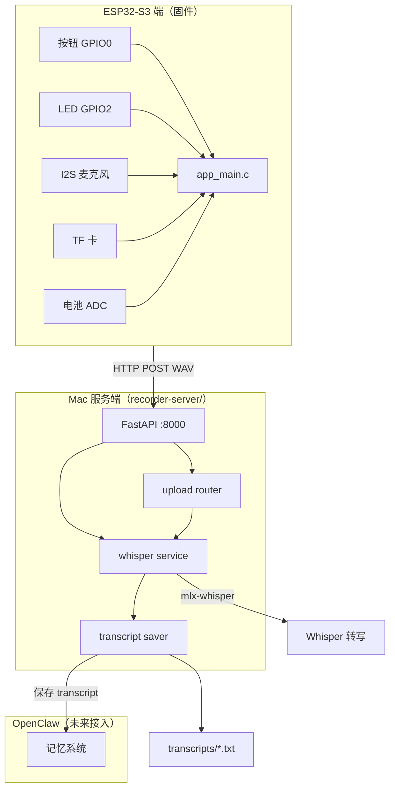
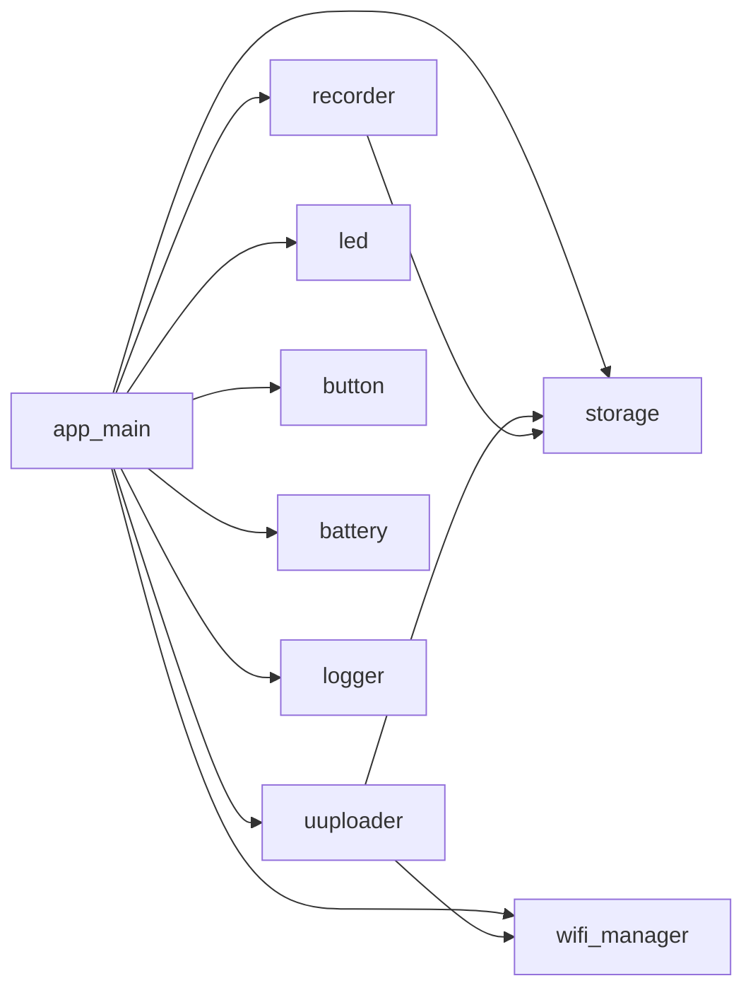
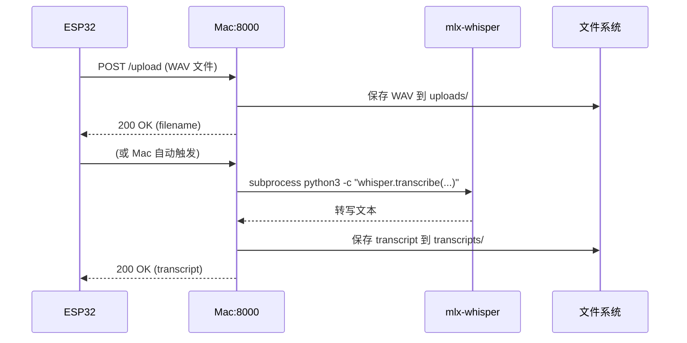

# 系统架构文档

> ESP32 AI Recorder — 系统架构
> 版本：v0.1 | 日期：2026-05-09

---

## 1. 系统总览



---

## 2. ESP32 端结构

```
firmware/
├── main/
│   └── app_main.c          ← 主入口，状态机调度
├── components/
│   ├── recorder/          ← I2S 录音（stub → 真实）
│   ├── wifi_manager/      ← WiFi 连接管理
│   ├── uploader/         ← HTTP 上传到 Mac
│   ├── storage/          ← TF 卡读写
│   ├── led/              ← LED 状态指示
│   ├── button/           ← 按钮事件处理
│   ├── battery/          ← 电池电量检测
│   └── logger/           ← 统一日志组件
├── scripts/              ← 开发辅助脚本
├── config/               ← YAML 配置文件
└── docs/                ← 项目文档
```

### 2.1 组件依赖关系



---

## 3. Mac 服务端结构（重构后）

```
recorder-server/
├── app/
│   └── main.py           ← FastAPI 应用入口
├── routers/
│   ├── __init__.py
│   ├── upload.py         ← POST /upload, POST /whisper
│   └── status.py        ← GET /, GET /health, GET /files
├── services/
│   ├── __init__.py
│   └── whisper_service.py  ← mlx-whisper 转写服务
├── utils/
│   ├── __init__.py
│   ├── transcript_saver.py ← transcript 保存工具
│   └── logging_config.py  ← 统一日志配置
├── uploads/              ← 接收的 WAV 文件
├── transcripts/          ← 转写结果（txt + json）
├── archive/              ← 归档目录（未来）
├── logs/                ← 服务端日志（未来）
├── pyproject.toml       ← uv 依赖管理
└── README.md
```

---

## 4. Whisper 转写链路



---

## 5. 文件流向

```
[I2S 麦克风]
        ↓
[WAV 文件 /sdcard/records/*.wav]
        ↓  (录音完成）
[HTTP POST /upload]
        ↓
[Mac: uploads/REC_xxx.wav]
        ↓  (自动触发）
[mlx-whisper 转写]
        ↓
[transcripts/REC_xxx_transcript.txt]
        ↓  (未来）
[OpenClaw 记忆系统]
```

---

## 6. 配置系统

```
config/
├── server.yaml   ← 服务器地址、WiFi、日志级别
├── audio.yaml    ← 采样率、位深、I2S 引脚
└── device.yaml   ← ESP32 型号、GPIO 分配、电源参数

↓  开发阶段：C 代码读取 YAML（或写死默认值）
↓  量产阶段：写入 NVS（Non-Volatile Storage）
```

---

## 7. 日志体系

### 7.1 ESP32 端

```
级别：ESP_LOGE > ESP_LOGW > ESP_LOGI > ESP_LOGD
输出：console（串口） → 未来：TF 卡 + 网络
TAG：  MAIN, WIFI, RECODER, UPLOAD, STOR, BTN, BAT, LOGGER
```

### 7.2 Mac 服务端

```
Python logging 模块
格式：[时间戳] [级别] [模块名] 消息
输出：console（uvicorn 前台） → 未来：文件 + 数据库
logger 名称：server.app, server.upload, server.whisper
```

---

## 8. 状态机（简述）

详见 `docs/state-machine.md`

```
BOOT → IDLE ⇄ RECORDING → SAVE_PENDING
                                    ↓
                            WIFI_CONNECTING → UPLOADING
                                                    ↓
                                                IDLE ⇄ SLEEP
所有状态均可进入 ERROR（错误恢复 → IDLE）
```

---

## 9. 未来扩展预留

### 9.1 OTA 固件升级

```
ESP32 → HTTPS GET 新固件 → Flash 写入 → 重启
预留：firmware/ components/ota （Phase 4 实现）
```

### 9.2 BLE 配网

```
手机 App → BLE → ESP32 接收 WiFi 凭证 → 写入 NVS → 连接
预留：components/ble_prov （Phase 2 实现）
```

### 9.3 AES 加密传输

```
ESP32 端 AES-128-CBC 加密 → Mac 端解密 → Whisper 转写
预留：components/aes_crypto （Phase 3 实现）
```

### 9.4 OpenClaw 记忆集成

```
transcript 文本 → OpenClaw API → 长期记忆存储
预留：services/openclaw_client.py （Phase 3 实现）
```

---

## 10. 技术栈汇总

| 层级 | 技术 |
|------|------|
| 固件框架 | ESP-IDF v5.2.3 |
| 芯片 | ESP32-S3 (Xtensa LX7) |
| 音频接口 | I2S (PCM) |
| 存储 | TF 卡 (SPI) |
| 网络 | WiFi 802.11 b/g/n |
| 服务端语言 | Python 3.11 |
| 服务端框架 | FastAPI + uvicorn |
| 转写引擎 | mlx-whisper (mlx 0.31.2, Metal GPU) |
| 音频处理 | ffmpeg 8.1.1 |
| 配置格式 | YAML |
| 文档格式 | Markdown + Mermaid |
| 构建工具 | idf.py, CMake |
| 包管理（Mac） | uv |

---

## 11. 当前完成度

| 模块 | 完成度 | 备注 |
|------|--------|------|
| ESP-IDF 环境 | 100% | 全部初始化完成 |
| 工具链 | 100% | Xtensa + Python venv |
| Whisper 环境 | 100% | mlx-whisper + tiny 模型 |
| 固件模板 | 80% | 可编译，功能为 stub |
| 组件（8个） | 20% | 桩实现，待硬件到货 |
| 脚本工具 | 100% | 6 个脚本全部完成 |
| 文档体系 | 80% | 缺 architecture.md（本文件）、test-plan.md |
| 配置系统 | 60% | YAML 已创建，C 代码未集成 |
| 日志系统 | 40% | logger 组件已创建，各模块未完全接入 |
| Mac 服务端 | 90% | 重构完成，待接入真实 Whisper 环境 |
| Mock 测试链路 | 80% | 脚本已完成，待测试 |
