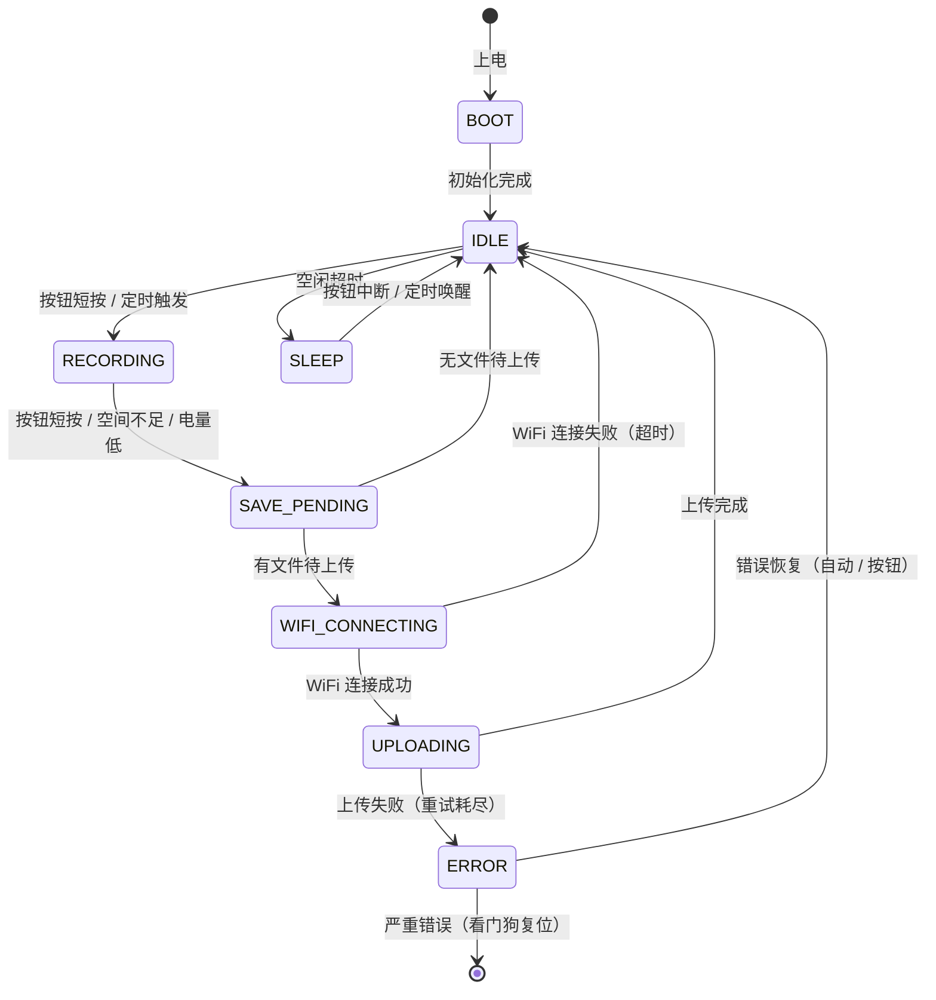

# 状态机设计文档

> ESP32 AI Recorder 系统状态机
> 版本：v0.1 | 日期：2026-05-09

---

## 1. 状态总览

---

## 2. 各状态详细说明

### 2.1 BOOT（启动）

| 项目 | 说明 |
|------|------|
| **职责** | 上电后一次性初始化，完成后不再进入 |
| **入口** | 上电 / 复位 / 看门狗复位 |
| **出口** | 初始化成功 → IDLE；初始化失败 → ERROR |
| **允许中断** | ❌ 不允许，必须完成初始化 |
| **原子性** | ✅ 必须原子执行 |

**初始化步骤：**
1. NVS 初始化
2. SD 卡挂载
3. LED GPIO 初始化
4. 按钮初始化
5. 电池 ADC 初始化
6. WiFi 初始化（不阻塞）
7. 录音模块初始化
8. 上传模块初始化
9. 加载配置（NVS + 配置文件）
10. 扫描 SD 卡是否有未上传文件

**超时保护：** 若任何步骤超过 10 秒，进入 ERROR 状态。

---

### 2.2 IDLE（空闲）

| 项目 | 说明 |
|------|------|
| **职责** | 等待用户操作或定时事件，低功耗待机 |
| **入口** | BOOT 完成 / 上传完成 / 休眠唤醒 |
| **出口** | 按钮短按 → RECORDING；空闲超时 → SLEEP；有文件待上传 → WIFI_CONNECTING |
| **允许中断** | ✅ 允许（按钮、定时器） |
| **原子性** | ❌ 不需要 |

**活动：**
- LED 慢闪（1Hz）表示等待
- 每 5 秒检查一次电池电量
- 每 30 秒检查一次是否有待上传文件
- 监听按钮事件

**退出条件：**
- 按钮短按 → RECORDING
- 有文件待上传且 WiFi 已连接 → UPLOADING
- 有文件待上传且 WiFi 未连接 → WIFI_CONNECTING
- 空闲超时（可配置，默认 60 秒）→ SLEEP

---

### 2.3 RECORDING（录音中）

| 项目 | 说明 |
|------|------|
| **职责** | 通过 I2S 接收麦克风数据，写入 WAV 文件到 SD 卡 |
| **入口** | IDLE 状态收到按钮短按 / 定时触发 |
| **出口** | 按钮短按 → SAVE_PENDING；空间不足 → SAVE_PENDING；电量低 → SAVE_PENDING |
| **允许中断** | ⚠️ 只允许按钮中断（长按强制停止） |
| **原子性** | ❌ 不需要（但中断需快速处理） |

**活动：**
- I2S 接收音频数据
- 实时写入 SD 卡（WAV 格式）
- LED 快闪（5Hz）表示录音中
- 每 1 秒更新一次文件大小
- 监控电池电量（低于 10% 触发停止）

**中断处理：**
- 按钮短按 → 正常停止，进入 SAVE_PENDING
- 按钮长按（>3 秒）→ 强制停止，进入 SAVE_PENDING
- 空间不足 → 停止录音，进入 SAVE_PENDING
- 电量低（<5%）→ 停止录音，进入 SAVE_PENDING

---

### 2.4 SAVE_PENDING（保存待上传）

| 项目 | 说明 |
|------|------|
| **职责** | 关闭 WAV 文件，更新文件头，标记待上传 |
| **入口** | RECORDING 停止 |
| **出口** | 有文件待上传 → WIFI_CONNECTING；无文件 → IDLE |
| **允许中断** | ❌ 不允许，必须完成文件保存 |
| **原子性** | ✅ 必须原子执行 |

**活动：**
1. 关闭 WAV 文件（更新 RIFF header 的 file size）
2. 在文件末尾写入元数据（时间戳、电量、录音参数）
3. 在 `/sdcard/pending/` 创建上传任务文件（JSON）
4. 检查是否有其他待上传文件

**错误处理：**
- 若文件关闭失败 → 标记文件为损坏，跳过
- 若 SD 卡满载 → 删除最旧的文件（可配置）

---

### 2.5 WIFI_CONNECTING（WiFi 连接中）

| 项目 | 说明 |
|------|------|
| **职责** | 连接 WiFi，获取 IP 地址 |
| **入口** | SAVE_PENDING 有文件待上传，且 WiFi 未连接 |
| **出口** | 连接成功 → UPLOADING；失败 → IDLE（重试机制） |
| **允许中断** | ❌ 不允许（但 WiFi 事件回调是异步的） |
| **原子性** | ⚠️ 半原子（连接过程是异步的，但状态切换是原子的） |

**活动：**
1. 检查是否已保存的 WiFi 凭证（NVS）
2. 若没有 → 进入配网模式（BLE / SmartConfig）
3. 若有 → 尝试连接
4. 超时 15 秒 → 重试（最多 3 次）
5. 重试耗尽 → 返回 IDLE（延迟上传）

**配网模式（Phase 2 实现）：**
- 启动 BLE 服务器，等待手机 App 配置 WiFi
- 或启动 SmartConfig，等待 ESP-Touch App

---

### 2.6 UPLOADING（上传中）

| 项目 | 说明 |
|------|------|
| **职责** | 将 SD 卡上的录音文件上传到 Mac 服务器 |
| **入口** | WIFI_CONNECTING 成功 / IDLE 检测到待上传文件且 WiFi 已连接 |
| **出口** | 上传成功 → IDLE；失败重试耗尽 → ERROR |
| **允许中断** | ❌ 不允许（上传过程可被取消，但不是中断） |
| **原子性** | ⚠️ 半原子（上传是分块的，但整个上传任务应该完成或失败） |

**活动：**
1. 从 `/sdcard/pending/` 读取上传任务
2. 逐个上传文件（HTTP POST multipart/form-data）
3. 显示上传进度（LED 呼吸灯）
4. 上传成功后，将文件从 `/sdcard/pending/` 移到 `/sdcard/done/`
5. 上传失败后，重试（最多 3 次，间隔 5 秒）

**错误处理：**
- 网络断开 → 暂停上传，返回 WIFI_CONNECTING
- 服务器 4xx → 放弃该文件（可能损坏），标记为失败
- 服务器 5xx → 重试
- 超时（30 秒）→ 重试

---

### 2.7 SLEEP（休眠）

| 项目 | 说明 |
|------|------|
| **职责** | 低功耗模式，等待中断唤醒 |
| **入口** | IDLE 状态空闲超时 |
| **出口** | 按钮中断 → IDLE；定时唤醒 → IDLE；电量极低 → [*]（关机） |
| **允许中断** | ✅ 允许（按钮、定时器、电量监控） |
| **原子性** | ❌ 不需要 |

**活动：**
1. 保存当前状态到 NVS
2. 关闭不必要的外设（I2S、WiFi）
3. 配置唤醒源（按钮 GPIO 中断、定时器）
4. 进入 DeepSleep

**唤醒条件：**
- 按钮按下（GPIO 中断）
- 定时器到期（可配置，默认 10 分钟）
- 电量监控（若电量 < 5%，不进入 DeepSleep，直接关机）

---

### 2.8 ERROR（错误）

| 项目 | 说明 |
|------|------|
| **职责** | 处理不可恢复错误或多次重试失败 |
| **入口** | 任何状态发生严重错误 |
| **出口** | 自动恢复 → IDLE；看门狗 → [*]（复位） |
| **允许中断** | ✅ 允许（按钮强制复位） |
| **原子性** | ❌ 不需要 |

**活动：**
1. 记录错误日志（SD 卡 + 串口）
2. LED 快闪（10Hz）表示错误
3. 显示错误码（通过 LED 闪烁次数）
4. 尝试恢复（重新初始化故障模块）
5. 若恢复失败 → 看门狗复位

**错误码：**
- 1 闪：SD 卡故障
- 2 闪：WiFi 连接失败
- 3 闪：上传失败
- 4 闪：电池电量极低
- 5 闪：I2S 故障

**恢复策略：**
- SD 卡故障 → 重新挂载（最多 3 次）
- WiFi 连接失败 → 返回 IDLE，延迟重试
- 上传失败 → 返回 IDLE，延迟重试
- 电池电量极低 → 关机（不进入 DeepSleep）
- I2S 故障 → 复位（看门狗）

---

## 3. 状态切换事件汇总

| 事件 | 源状态 | 目标状态 | 条件 |
|------|--------|----------|------|
| 按钮短按 | IDLE | RECORDING | - |
| 按钮短按 | RECORDING | SAVE_PENDING | - |
| 按钮长按（>3s） | RECORDING | SAVE_PENDING | 强制停止 |
| 空间不足 | RECORDING | SAVE_PENDING | SD 卡剩余 < 1MB |
| 电量低（<5%） | RECORDING | SAVE_PENDING | - |
| 初始化完成 | BOOT | IDLE | - |
| 初始化失败 | BOOT | ERROR | - |
| 有文件待上传 | IDLE | WIFI_CONNECTING | WiFi 未连接 |
| 有文件待上传 | IDLE | UPLOADING | WiFi 已连接 |
| 空闲超时 | IDLE | SLEEP | 可配置，默认 60s |
| WiFi 连接成功 | WIFI_CONNECTING | UPLOADING | - |
| WiFi 连接失败 | WIFI_CONNECTING | IDLE | 重试耗尽 |
| 上传成功 | UPLOADING | IDLE | - |
| 上传失败 | UPLOADING | ERROR | 重试耗尽 |
| 按钮中断 | SLEEP | IDLE | - |
| 定时唤醒 | SLEEP | IDLE | - |
| 自动恢复 | ERROR | IDLE | - |
| 看门狗超时 | ERROR | [*] | 恢复失败 |

---

## 4. 设计原则

1. **单一职责**：每个状态只做一件事
2. **状态最小化**：不在状态中做多余的事
3. **错误可恢复**：任何状态都能回到 IDLE
4. **低功耗优先**：尽可能快地进入 SLEEP
5. **用户可感知**：通过 LED 和按钮，用户知道当前状态

---

## 5. 后续扩展

- [ ] 添加 `CONFIG` 状态（BLE 配网）
- [ ] 添加 `FIRMWARE_UPDATE` 状态（OTA）
- [ ] 添加 `DIAGNOSTIC` 状态（自检模式）
- [ ] 添加状态历史记录（NVS 循环缓冲区）
